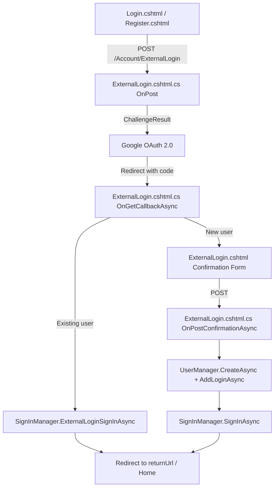
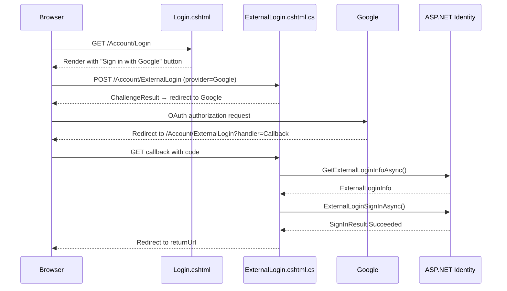
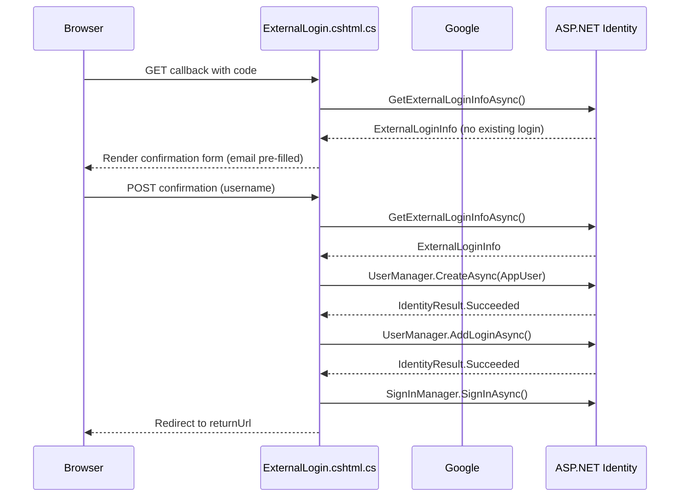

# Design Document: Google Login

## Overview

This feature integrates Google OAuth 2.0 as an external authentication provider into the Netflix clone application. It builds on the existing ASP.NET Identity scaffolding — `AppUser`, `SignInManager`, `UserManager`, and the existing Login/Register Razor Pages — adding the Google middleware, a new `ExternalLogin` Razor Page, and minimal view changes to surface the provider buttons.

The implementation follows the standard ASP.NET Core external login pattern: the user clicks a provider button, the app issues a challenge, Google authenticates the user and redirects back to the callback handler, and the handler either signs in a returning user or guides a new user through a one-step confirmation form before creating their account.

## Architecture



## Sequence Diagrams

### Returning User Flow



### New User Flow



## Components and Interfaces

### 1. NuGet Package

**Package**: `Microsoft.AspNetCore.Authentication.Google` version `10.0.0`

Add to `Netflix-clone.csproj`:

```xml
<PackageReference Include="Microsoft.AspNetCore.Authentication.Google" Version="10.0.0" />
```

### 2. Program.cs — Google Provider Registration

**Purpose**: Register the Google authentication handler and validate credentials at startup.

Chain `.AddGoogle(...)` onto the existing `AddIdentity` call:

```csharp
builder.Services.AddIdentity<AppUser, IdentityRole>(options => options.SignIn.RequireConfirmedAccount = false)
    .AddEntityFrameworkStores<NetflixContext>()
    .AddDefaultTokenProviders()
    .AddDefaultUI()
    .AddGoogle(options =>
    {
        options.ClientId = builder.Configuration["Authentication:Google:ClientId"]
            ?? throw new InvalidOperationException("Authentication:Google:ClientId is not configured.");
        options.ClientSecret = builder.Configuration["Authentication:Google:ClientSecret"]
            ?? throw new InvalidOperationException("Authentication:Google:ClientSecret is not configured.");
    });
```

**Startup validation**: The null-coalescing throw pattern causes the application to fail fast at startup if either credential is missing, surfacing a clear `InvalidOperationException` message before any request is served.

### 3. appsettings.json — Credential Placeholders

Add the following section to `appsettings.json`. The placeholder values must be replaced with real credentials from the Google Cloud Console before running the application:

```json
"Authentication": {
  "Google": {
    "ClientId": "YOUR_GOOGLE_CLIENT_ID",
    "ClientSecret": "YOUR_GOOGLE_CLIENT_SECRET"
  }
}
```

### 4. ExternalLogin Razor Page

**Files to create**:
- `Areas/Identity/Pages/Account/ExternalLogin.cshtml`
- `Areas/Identity/Pages/Account/ExternalLogin.cshtml.cs`

#### Page Model — ExternalLogin.cshtml.cs

```csharp
namespace Netflix_clone.Areas.Identity.Pages.Account
{
    public class ExternalLoginModel : PageModel
    {
        private readonly SignInManager<AppUser> _signInManager;
        private readonly UserManager<AppUser> _userManager;
        private readonly ILogger<ExternalLoginModel> _logger;

        public ExternalLoginModel(
            SignInManager<AppUser> signInManager,
            UserManager<AppUser> userManager,
            ILogger<ExternalLoginModel> logger)
        {
            _signInManager = signInManager;
            _userManager = userManager;
            _logger = logger;
        }

        [BindProperty]
        public InputModel Input { get; set; }

        public string ProviderDisplayName { get; set; }
        public string ReturnUrl { get; set; }

        [TempData]
        public string ErrorMessage { get; set; }

        public class InputModel
        {
            [Required]
            [EmailAddress]
            public string Email { get; set; }

            [Required]
            [StringLength(256, MinimumLength = 1)]
            [Display(Name = "Username")]
            public string UserName { get; set; }
        }

        public IActionResult OnPost(string provider, string returnUrl = null)
        {
            if (string.IsNullOrEmpty(provider))
            {
                ErrorMessage = "Invalid external login provider.";
                return RedirectToPage("./Login");
            }

            var redirectUrl = Url.Page("./ExternalLogin", pageHandler: "Callback",
                values: new { returnUrl });
            var properties = _signInManager.ConfigureExternalAuthenticationProperties(
                provider, redirectUrl);
            return new ChallengeResult(provider, properties);
        }

        public async Task<IActionResult> OnGetCallbackAsync(
            string returnUrl = null, string remoteError = null)
        {
            returnUrl ??= Url.Content("~/");

            if (remoteError != null)
            {
                ErrorMessage = $"Error from external provider: {remoteError}";
                return RedirectToPage("./Login", new { ReturnUrl = returnUrl });
            }

            var info = await _signInManager.GetExternalLoginInfoAsync();
            if (info == null)
            {
                ErrorMessage = "Error loading external login information.";
                return RedirectToPage("./Login", new { ReturnUrl = returnUrl });
            }

            var result = await _signInManager.ExternalLoginSignInAsync(
                info.LoginProvider, info.ProviderKey,
                isPersistent: false, bypassTwoFactor: true);

            if (result.Succeeded)
            {
                return LocalRedirect(returnUrl);
            }
            if (result.IsLockedOut)
            {
                return RedirectToPage("./Lockout");
            }
            if (result.IsNotAllowed || result.RequiresTwoFactor)
            {
                ErrorMessage = "External login is not allowed for this account.";
                return RedirectToPage("./Login", new { ReturnUrl = returnUrl });
            }

            var email = info.Principal.FindFirstValue(ClaimTypes.Email);
            if (string.IsNullOrEmpty(email))
            {
                ErrorMessage = "Email claim not received from Google. Cannot create account.";
                return RedirectToPage("./Login", new { ReturnUrl = returnUrl });
            }

            ReturnUrl = returnUrl;
            ProviderDisplayName = info.ProviderDisplayName;
            Input = new InputModel { Email = email };
            return Page();
        }

        public async Task<IActionResult> OnPostConfirmationAsync(string returnUrl = null)
        {
            returnUrl ??= Url.Content("~/");

            var info = await _signInManager.GetExternalLoginInfoAsync();
            if (info == null)
            {
                ErrorMessage = "Error loading external login information during confirmation.";
                return RedirectToPage("./Login", new { ReturnUrl = returnUrl });
            }

            if (!ModelState.IsValid)
            {
                ProviderDisplayName = info.ProviderDisplayName;
                ReturnUrl = returnUrl;
                return Page();
            }

            var user = new AppUser();
            await _userManager.SetUserNameAsync(user, Input.UserName);
            await _userManager.SetEmailAsync(user, Input.Email);

            var createResult = await _userManager.CreateAsync(user);
            if (!createResult.Succeeded)
            {
                foreach (var error in createResult.Errors)
                    ModelState.AddModelError(string.Empty, error.Description);
                ProviderDisplayName = info.ProviderDisplayName;
                ReturnUrl = returnUrl;
                return Page();
            }

            var addLoginResult = await _userManager.AddLoginAsync(user, info);
            if (!addLoginResult.Succeeded)
            {
                await _userManager.DeleteAsync(user);
                foreach (var error in addLoginResult.Errors)
                    ModelState.AddModelError(string.Empty, error.Description);
                ProviderDisplayName = info.ProviderDisplayName;
                ReturnUrl = returnUrl;
                return Page();
            }

            await _signInManager.SignInAsync(user, isPersistent: false, info.LoginProvider);
            return LocalRedirect(returnUrl);
        }
    }
}
```

#### View — ExternalLogin.cshtml

```razor
@page "/Account/ExternalLogin"
@model ExternalLoginModel
@{
    ViewData["Title"] = "Register with " + @Model.ProviderDisplayName;
}

<partial name="_MovieFormStyle" />

<div class="form-page">
    <div class="form-card">
        <div class="form-card__header">
            <div class="form-card__icon">🔗</div>
            <div>
                <div class="form-card__title">Complete Registration</div>
                <div class="form-card__sub">
                    You've authenticated with <strong>@Model.ProviderDisplayName</strong>.
                    Please enter a username to finish creating your account.
                </div>
            </div>
        </div>

        <form asp-page-handler="Confirmation" asp-route-returnUrl="@Model.ReturnUrl" method="post">
            <div class="form-card__body">
                <div asp-validation-summary="ModelOnly" class="form-error-box" role="alert"></div>

                <div class="form-field">
                    <label asp-for="Input.Email" class="form-label">Email</label>
                    <input asp-for="Input.Email" class="form-input" readonly />
                </div>

                <div class="form-field">
                    <label asp-for="Input.UserName" class="form-label">Username</label>
                    <input asp-for="Input.UserName" class="form-input"
                           autocomplete="username" aria-required="true"
                           placeholder="Choose a username" />
                    <span asp-validation-for="Input.UserName" class="form-field-error"></span>
                </div>
            </div>

            <div class="form-footer" style="justify-content:flex-end;">
                <button type="submit" class="btn-submit">Create Account</button>
            </div>
        </form>
    </div>
</div>

@section Scripts {
    <partial name="_ValidationScriptsPartial" />
}
```

### 5. Login.cshtml — External Provider Buttons

Add the external login section inside `.form-card`, after the closing `</form>` tag of the password form and before the closing `</div>` of `.form-card`:

```razor
@if (Model.ExternalLogins?.Count > 0)
{
    <div style="margin-top:24px;padding-top:20px;border-top:1px solid var(--border);">
        <p style="font-size:13px;color:var(--text-muted);text-align:center;margin-bottom:12px;">
            Or sign in with
        </p>
        <form asp-area="Identity" asp-page="/Account/ExternalLogin"
              asp-route-returnUrl="@Model.ReturnUrl" method="post">
            <div style="display:flex;flex-direction:column;gap:8px;">
                @foreach (var provider in Model.ExternalLogins)
                {
                    <button type="submit" name="provider" value="@provider.Name"
                            class="btn-submit"
                            style="background:transparent;border:1px solid var(--border);color:var(--text);">
                        Sign in with @provider.DisplayName
                    </button>
                }
            </div>
        </form>
    </div>
}
```

### 6. Register.cshtml — External Provider Buttons

Add the same external login section inside `.form-card`, after the closing `</form>` tag of the registration form and before the closing `</div>` of `.form-card`:

```razor
@if (Model.ExternalLogins?.Count > 0)
{
    <div style="margin-top:24px;padding-top:20px;border-top:1px solid var(--border);">
        <p style="font-size:13px;color:var(--text-muted);text-align:center;margin-bottom:12px;">
            Or sign up with
        </p>
        <form asp-area="Identity" asp-page="/Account/ExternalLogin"
              asp-route-returnUrl="@Model.ReturnUrl" method="post">
            <div style="display:flex;flex-direction:column;gap:8px;">
                @foreach (var provider in Model.ExternalLogins)
                {
                    <button type="submit" name="provider" value="@provider.Name"
                            class="btn-submit"
                            style="background:transparent;border:1px solid var(--border);color:var(--text);">
                        Sign up with @provider.DisplayName
                    </button>
                }
            </div>
        </form>
    </div>
}
```

## Data Models

### InputModel (ExternalLogin confirmation form)

```csharp
public class InputModel
{
    [Required]
    [EmailAddress]
    public string Email { get; set; }

    [Required]
    [StringLength(256, MinimumLength = 1)]
    [Display(Name = "Username")]
    public string UserName { get; set; }
}
```

**Validation rules**:
- `Email` must be a valid email address and is sourced from Google claims (read-only in the form).
- `UserName` must be 1–256 non-whitespace characters and must be unique across all `AppUser` records (enforced by `UserManager.CreateAsync`).

### AppUser (unchanged)

No changes to `AppUser`. The external login association is stored in the `AspNetUserLogins` table managed by Identity, keyed on `(LoginProvider, ProviderKey)`.

## Error Handling

### Remote Error from Google (user denied consent)

**Condition**: `remoteError` query parameter is non-null on the callback URL.  
**Response**: Set `ErrorMessage` TempData, redirect to Login page.  
**Recovery**: User sees the error in the Login page's error summary and can retry.

### Missing ExternalLoginInfo

**Condition**: `GetExternalLoginInfoAsync()` returns null (session expired or cookie lost).  
**Response**: Set `ErrorMessage` TempData, redirect to Login page.  
**Recovery**: User restarts the OAuth flow from the Login page.

### Missing Email Claim

**Condition**: Google claims do not include `ClaimTypes.Email`.  
**Response**: Set `ErrorMessage` TempData, redirect to Login page. Confirmation page is never shown.  
**Recovery**: User must use a Google account that exposes an email, or use password login.

### Account Lockout

**Condition**: `ExternalLoginSignInAsync` returns `IsLockedOut = true`.  
**Response**: Redirect to the existing `./Lockout` page.  
**Recovery**: Standard lockout expiry or admin unlock.

### AddLoginAsync Failure After CreateAsync Success

**Condition**: `UserManager.AddLoginAsync` fails after the `AppUser` row was already inserted.  
**Response**: Call `UserManager.DeleteAsync(user)` to roll back, add errors to `ModelState`, redisplay confirmation form.  
**Recovery**: No partial account is left; user can retry.

### Missing Credentials at Startup

**Condition**: `Authentication:Google:ClientId` or `Authentication:Google:ClientSecret` is absent from configuration.  
**Response**: `InvalidOperationException` thrown during `builder.Build()`, application does not start.  
**Recovery**: Developer adds the missing configuration value.

### Unhandled Exception During Callback

**Condition**: Unexpected exception in any callback handler.  
**Response**: ASP.NET Core's default exception middleware logs the exception at error level and returns the configured error page. The user is not shown internal details.

## Testing Strategy

### Unit Testing Approach

Test `ExternalLoginModel` handler logic in isolation by mocking `SignInManager<AppUser>` and `UserManager<AppUser>`:

- `OnPost` with null/empty provider → returns `RedirectToPageResult` to Login with error.
- `OnPost` with valid provider → returns `ChallengeResult` with correct provider and redirect URL.
- `OnGetCallbackAsync` with `remoteError` set → redirects to Login with error.
- `OnGetCallbackAsync` with null `ExternalLoginInfo` → redirects to Login with error.
- `OnGetCallbackAsync` with existing login → calls `ExternalLoginSignInAsync`, redirects to `returnUrl`.
- `OnGetCallbackAsync` with lockout result → redirects to Lockout page.
- `OnGetCallbackAsync` with no existing login and valid email → returns `Page()` with `Input.Email` pre-filled.
- `OnGetCallbackAsync` with no email claim → redirects to Login with error.
- `OnPostConfirmationAsync` with null `ExternalLoginInfo` → redirects to Login with error.
- `OnPostConfirmationAsync` with invalid `ModelState` → returns `Page()`.
- `OnPostConfirmationAsync` with `CreateAsync` failure → returns `Page()` with errors, no user created.
- `OnPostConfirmationAsync` with `AddLoginAsync` failure → deletes user, returns `Page()` with errors.
- `OnPostConfirmationAsync` with full success → signs in, redirects to `returnUrl`.

### Property-Based Testing Approach

**Property Test Library**: `FsCheck` (xUnit integration via `FsCheck.Xunit`)

Key properties to verify:

- For any non-null, non-empty `returnUrl` that is a valid local URL, a successful sign-in always redirects to exactly that URL.
- For any `UserName` string longer than 256 characters or consisting entirely of whitespace, `OnPostConfirmationAsync` never creates an `AppUser` record.
- For any `provider` string that is null or empty, `OnPost` never issues a `ChallengeResult`.
- After a failed `AddLoginAsync`, the number of `AppUser` records in the store is identical to the count before `OnPostConfirmationAsync` was called (no partial accounts).

### Integration Testing Approach

Use `WebApplicationFactory<Program>` with a test `appsettings` that supplies dummy Google credentials and an in-memory or SQLite database:

- Verify that `GET /Account/Login` returns HTTP 200 and the response body contains the text "Sign in with Google" when the Google provider is registered.
- Verify that `GET /Account/Register` returns HTTP 200 and the response body contains the text "Sign up with Google".
- Verify that `POST /Account/ExternalLogin` with `provider=Google` returns a redirect (302) whose `Location` header begins with `https://accounts.google.com`.
- Verify that the application fails to start (throws during `Build()`) when `Authentication:Google:ClientId` is absent from configuration.

## Security Considerations

- **Credentials in source code**: `ClientId` and `ClientSecret` are read exclusively from configuration. The startup validation ensures the app never runs with empty credentials.
- **Open redirect prevention**: All `returnUrl` values are passed through `LocalRedirect(returnUrl)`, which throws if the URL is not local, preventing open redirect attacks.
- **Partial account cleanup**: If `AddLoginAsync` fails after `CreateAsync` succeeds, the orphaned `AppUser` is deleted immediately, preventing account enumeration via partial records.
- **External cookie clearing**: The existing `Login.cshtml.cs` `OnGetAsync` already calls `HttpContext.SignOutAsync(IdentityConstants.ExternalScheme)` before loading external schemes, ensuring no stale external session interferes.
- **No sensitive data in logs**: Exception handlers log at error level without including user credentials or tokens in the log message.

## Dependencies

| Dependency | Version | Purpose |
|---|---|---|
| `Microsoft.AspNetCore.Authentication.Google` | `10.0.0` | Google OAuth 2.0 middleware |
| `Microsoft.AspNetCore.Identity.EntityFrameworkCore` | `10.0.7` | Already present — stores `AspNetUserLogins` |
| `Microsoft.AspNetCore.Identity.UI` | `10.0.2` | Already present — scaffolded pages base |
| Google Cloud Console project | N/A | Provides `ClientId` and `ClientSecret`; OAuth redirect URI must be registered as `https://{host}/signin-google` |
